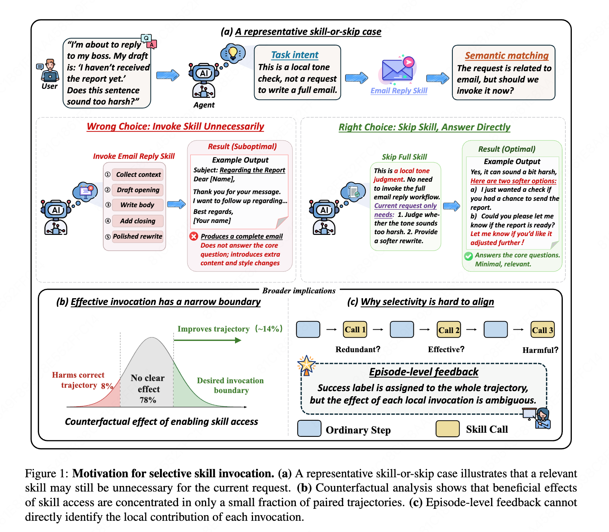
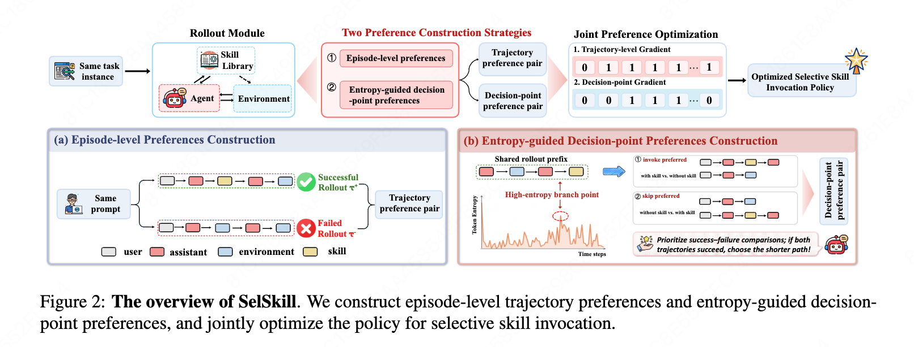

# Skill or Skip? Learning Selective Skill Invocation in Agentic Tasks via Dual-Granularity Preference Learning

Agent skills are callable procedural modules that provide reusable knowledge and execution policies for complex tasks. While prior work focuses on selecting *which* skill to use, we study a more fundamental question: **should a relevant skill actually be invoked at the current decision point?**

<p align="center">
  
</p>

<p align="center">
  
</p>

## Setup

Install dependencies from `requirements.txt`. Additional requirements:

- **ALFWorld**: `pip install alfworld==0.4.2` (or install from [source](https://github.com/alfworld/alfworld) and run `python -c "import alfworld.download; alfworld.download.download()"`)
- **BFCL evaluation**: install from [Berkeley Function Calling Leaderboard](https://github.com/ShishirPatil/gorilla/tree/main/berkeley-function-call-leaderboard)
- **verl** (DPO training only): install from [verl](https://github.com/volcengine/verl) source
- **Models**: download [Qwen3-8B](https://huggingface.co/Qwen/Qwen3-8B), [Qwen3-4B](https://huggingface.co/Qwen/Qwen3-4B), or [Qwen3-14B](https://huggingface.co/Qwen/Qwen3-14B) from HuggingFace

## Repository Structure

```
selskill/                  ALFWorld benchmark
  skills/                  10 ALFWorld skills (4 executable + 6 memory)
  prompts/templates.py     Prompt builder (loads skill listing from skills/)
  envs/skill_manager.py    Skill execution engine + tool schema builder
  envs/projection.py       Action extraction from model output
  scripts/
    eval.py                Evaluate on 128-episode held-out split
    rollout.py             Pass-N rollout for episode-level DPO data
    entropy_passK_rollout.py  Entropy-guided branching for step-level pairs
    build_dpo_pairs.py     Merge rollouts into preference parquet
    build_entropy_pairs.py Build step-level pairs from branched rollouts

bfcl/                      BFCL benchmark
  skills/                  18 BFCL skills
  skills_noisy/            38 skills (18 + 20 noise) for Appendix F
  prompts.py               Skill reminder builder (injected as system-reminder)
  scripts/                 eval / rollout / entropy_passK_rollout / build_dpo_pairs

tau_bench/skills/          11 Tau-bench airline skills (OOD eval)
tau_bench/skills_retail/   6 Tau-bench retail skills (OOD eval)
popqa/skills/              4 PopQA Wikipedia retrieval skills (OOD eval)

train/
  run_training.sh          DPO training (8× A100, requires verl)
  dataset.py               DPO dataset with branch_turn_n loss masking (copy to verl/utils/dataset/dpo_dataset.py)
  fsdp_dpo_trainer.py      Modified verl DPO trainer (copy to verl/trainer/fsdp_dpo_trainer.py)

shared/
  skill_utils.py           load_skills, calc_entropy, build_skill_tool_schema, etc.
  vllm_client.py           vLLM chat completion client

figures/
  data/                    Raw data for Figures 3–4
  scripts/                 Plotting scripts (Figure 3, 4, schematic, case figure, Appendix C)

experiments/
  rl_selectivity/      GRPO-noskill vs GRPO-bonus
  engineering_baselines/  Context injection / conservative prompt / skip skill
  entropy_branching/   Entropy vs random vs all-skill branching
  robustness/          Noisy skill listing robustness
  case_studies/        Annotated trajectories
  gradient_analysis/   Gradient peak distribution
  ood/                 PopQA OOD evaluation
```

## Evaluate

```bash
python selskill/scripts/eval.py \
  --model-path /path/to/checkpoint --skills-dir selskill/skills \
  --alfworld-data $ALFWORLD_DATA --config configs/alfworld_config.yaml \
  --output-dir eval_results/
```

## Training Pipeline

SelSkill uses iterative preference training (3 rounds for ALFWorld, 2 for BFCL). Each round:

1. **RL-Init** — train a no-skill base policy via GRPO ([verl](https://github.com/volcengine/verl))
2. **Episode-level rollouts** — `selskill/scripts/rollout.py`, K=10 per task
3. **Step-level rollouts** — `selskill/scripts/entropy_passK_rollout.py`, entropy-guided branching K=4
4. **Build preference pairs** — `selskill/scripts/build_dpo_pairs.py`, merges episode + step-level pairs
5. **DPO training** — `train/run_training.sh`, 8× A100, ~2.7h per round for 8B

Repeat steps 2–5 with the updated checkpoint each round.

## Skill Library

Each skill is a `.md` file with YAML frontmatter specifying its metadata and full content:

```markdown
---
description: Heat the held object in the microwave
when-to-use: When the task requires a heated object and the agent is holding it
execution-mode: executable    # or: memory
user-invocable: true
---

## Skill Body
Check that the microwave is reachable, then:
1. go to microwave 1
2. open microwave 1
...
```

Skill call format used by the model:
```
<tool_call>{"name": "heat_object"}</tool_call>
```

**Total 49 skills across all benchmarks:**

| Benchmark | Count | Type | Role |
|-----------|-------|------|------|
| `selskill/skills/` | 13 total (10 user-invocable: 4 executable + 6 memory) | ALFWorld | Train + eval |
| `bfcl/skills/` | 18 (8 executable + 10 memory) | BFCL | Train + eval |
| `tau_bench/skills/` + `skills_retail/` | 11 + 6 | Tau-bench | OOD eval |
| `popqa/skills/` | 4 (memory) | PopQA | OOD eval |
